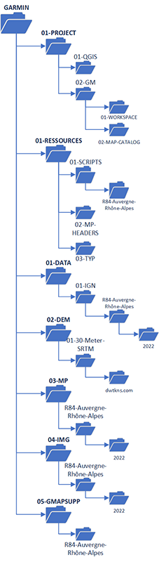

# **02-02/ Arborescence des dossiers**

Ici, c’est à vous d’organiser la façon dont vous allez structurer vos données. Je vous conseille d’être assez ordonné car vous allez vite vous perdre avec la multitude de fichiers que vous allez manipuler avec ce tutoriel.

Voici mon arborescence pour vous donner une idée :

``` bash
GARMIN-IGN-BDTOPO-MAP
├───01-PROJECTS
│   ├───01-QGIS
│   ├───02-GM
│   │   └───01-MAP-CATALOG
│   ├───03-FME
│   │   └───R04
│   └───04-MPC
├───02-RESSOURCES
│   ├───01-SCRIPTS
│   │   ├───01-GLOBALMAPPER
│   │   │   └───SAMPLES
│   │   └───02-MKGMAP
│   ├───02-MP-HEADERS
│   ├───03-TYP
│   │   ├───AllfabStudio-V1
│   │   ├───AllfabStudio-V2
│   │   │   └───Icons
│   │   │       └───OSM
│   │   │           ├───amenity
│   │   │           └───shop
│   │   ├───AllfabStudio-V3
│   │   ├───OSM
│   │   └───TOPO_France_V4_Pro
│   ├───04-CSV-XLS-TXT
│   ├───05-MANUAL
│   └───99-TOOLS
│       ├───MapSetToolKit_v1.77
│       ├───mkgmap-r4905
│       │   ├───doc
│       │   ├───examples
│       │   │   ├───chars
│       │   │   │   └───ascii
│       │   │   ├───installer
│       │   │   ├───styles
│       │   │   │   ├───default
│       │   │   │   │   └───inc
│       │   │   │   └───noname
│       │   │   └───typ-files
│       │   └───lib
│       ├───mkgmap-r4907
│       │   ├───doc
│       │   ├───examples
│       │   │   ├───chars
│       │   │   │   └───ascii
│       │   │   ├───installer
│       │   │   ├───styles
│       │   │   │   ├───default
│       │   │   │   │   └───inc
│       │   │   │   └───noname
│       │   │   └───typ-files
│       │   └───lib
│       └───mkgmap-r4922
│           ├───doc
│           ├───examples
│           │   ├───chars
│           │   │   └───ascii
│           │   ├───installer
│           │   ├───styles
│           │   │   ├───default
│           │   │   │   └───inc
│           │   │   └───noname
│           │   └───typ-files
│           └───lib
├───03-DATA-INPUT
│   ├───01-IGN-BDTOPO
│   │   ├───01-SHP
│   │   │   └───R04
│   │   │       └───v2024.09
│   │   │           ├───ADMINISTRATIF
│   │   │           ├───ADRESSES
│   │   │           ├───BATI
│   │   │           ├───EMPRISE
│   │   │           ├───HYDROGRAPHIE
│   │   │           ├───LIEUX_NOMMES
│   │   │           ├───OCCUPATION_DU_SOL
│   │   │           ├───SERVICES_ET_ACTIVITES
│   │   │           ├───TRANSPORT
│   │   │           └───ZONES_REGLEMENTEES
│   │   └───02-SQL
│   │       └───R04
│   │           └───2024-09-15
│   │               ├───ADMINISTRATIF
│   │               ├───ADRESSES
│   │               ├───BATI
│   │               ├───EMPRISE
│   │               ├───HYDROGRAPHIE
│   │               ├───LIEUX_NOMMES
│   │               ├───OCCUPATION_DU_SOL
│   │               ├───SERVICES_ET_ACTIVITES
│   │               ├───TRANSPORT
│   │               └───ZONES_REGLEMENTEES
│   ├───02-OSM
│   │   └───R04
│   │       └───v2024.09
│   ├───03-DEM
│   │   ├───01-SRTM30m
│   │   │   └───R04
│   │   └───02-CONTOUR-LINES
│   │       └───R04
│   ├───04-GR
│   │   ├───01-GPX
│   │   ├───01-GR@CCES
│   │   │   ├───CONF
│   │   │   ├───ESRI-JSON
│   │   │   ├───FME
│   │   │   └───OUTPUTS
│   │   │       └───SHP
│   │   ├───02-MP-SHP
│   │   └───03-OUTPUTS
│   ├───05-INSEE
│   └───06-CODE-POSTAUX
├───04-DATA-OUTPUT
│   ├───FRANCE-NORD
│   │   └───v2023.06
│   │       ├───01-BDTOPO
│   │       ├───02-OSM
│   │       ├───03-CONTOUR-LINES
│   │       ├───04-BOUNDS
│   │       └───05-GR
│   ├───FRANCE-SUD
│   │   └───v2023.06
│   │       ├───01-BDTOPO
│   │       ├───02-OSM
│   │       ├───03-CONTOUR-LINES
│   │       ├───04-BOUNDS
│   │       └───05-GR
│   └───R04
│       └───v2024.09
│           ├───01-SHP
│           │   ├───01-BDTOPO
│           │   ├───02-OSM
│           │   ├───03-CONTOUR-LINES
│           │   └───04-BOUNDS
│           └───02-GMP
├───05-POLISH-MP
│   └───R04
│       └───v2024.09
├───06-IMG
│   └───R04
│       └───v2024.09
├───07-MAPSET
│   └───R04
│       └───v2024.09
├───08-GMAPSUPP
├───09-BASECAMP
```


<figure markdown>
  
  <figcaption>Arborescence des dossiers/fichiers</figcaption>
</figure>

Évidemment, votre structure de dossiers ne doit pas nécessairement être exactement comme celle-ci.

Avec cette arborescence de dossiers, on visualise déjà le processus de création de la carte Garmin. Je détaillerai plus tard ce processus afin de bien comprendre comment on crée ce type de carte Topo.