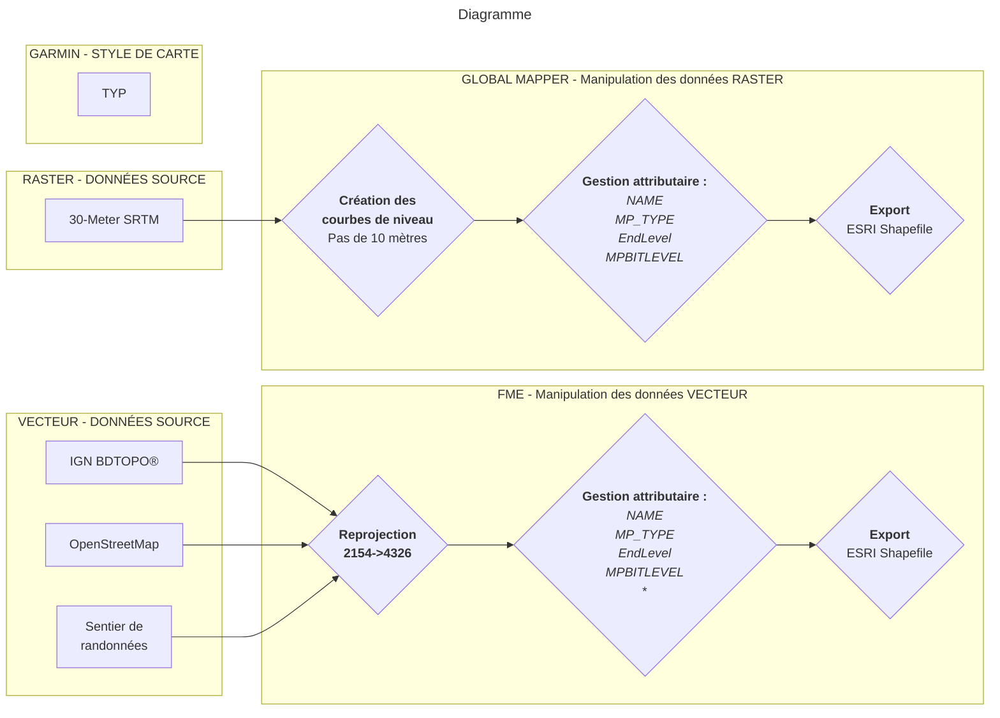

# **03-01/ Processus de création**

**Entrons dans le vif du sujet !** 

Voici un **diagramme** qui schématise les différentes étapes qu'il faut accomplir afin de créer une carte Garmin personnalisée.

Pour accéder à la documentation du noeud, cliquez dessus :material-cursor-default-click: !

<figure markdown>
  <figcaption>Cliquez sur les noeuds pour accéder à leur documentation</figcaption>
</figure>

[comment]: <> (http://mermaid.js.org/syntax/flowchart.html)