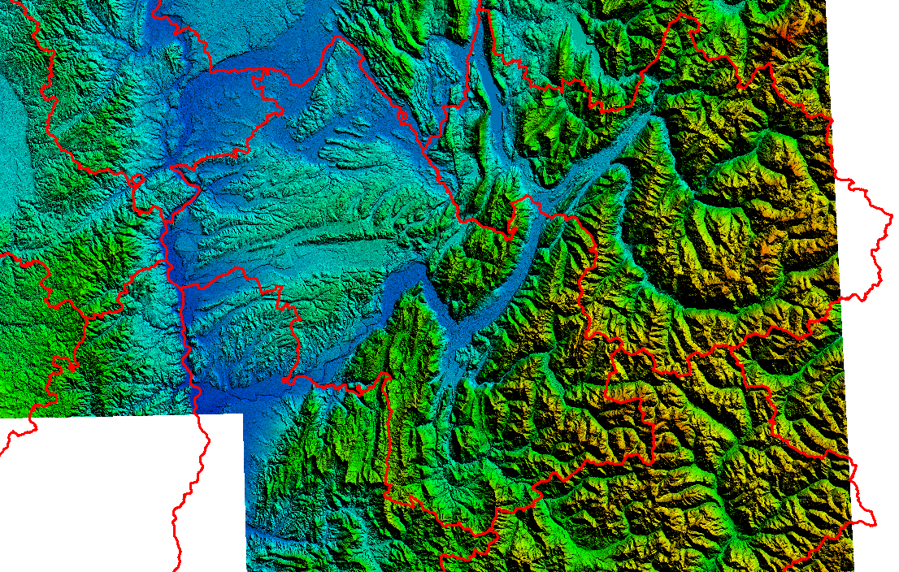
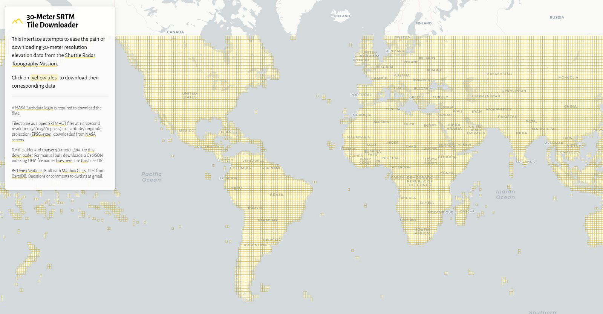
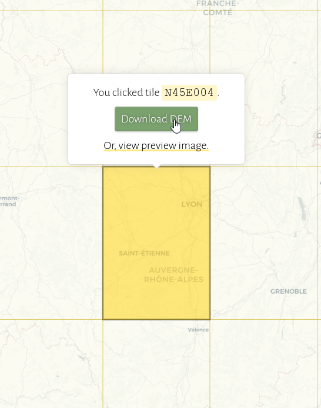
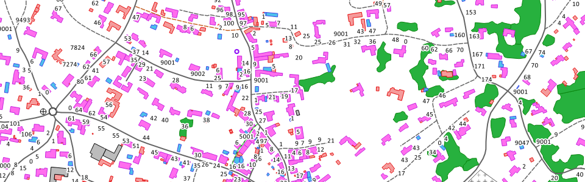

# **04-01/ Les courbes de niveau**

## **Téléchargement et préparation des données d'élévation (courbes de niveau & DEM)**

<figure markdown>
  
  <figcaption>Global Mapper - Chargement des tuiles *.HGT provenant de <a href="https://dwtkns.com/srtm30m/">https://dwtkns.com/srtm30m/</a></figcaption>
</figure>

### Téléchargement des données d'élévation SRTM HGT

<figure markdown>
  
</figure>

Comme évoqué dans la première partie de ce guide, nous allons commencé par [télécharger les données d'élévation au format](https://dwtkns.com/srtm30m/) __*.HGT__.

Lorsque vous êtes sur le site, il suffit de naviguer sur la carte et de cliquer sur la tuile que vous souhaitez télécharger. Il faut au préalable créer un compte sur le site de la NASA Earth Observation Data. L'interface vous demandera de vous connecter avec les identifiants de connexion que vous venez de créer sur NASA Earth Observation Data.

<figure markdown>
  
  <figcaption>Téléchargement d'une tuile au format SRTM HGT</figcaption>
</figure>

Je vous conseille ici de télécharger les tuiles qui correspondent au territoire sur lequel vous voulez créer votre carte Garmin. ***N'hésitez pas à télécharger les tuiles voisines à votre limite de territoire pour bien prendre en compte ce dernier et ne pas rencontrer de message d'erreur pendant la compilation des fichiers ==*.IMG== car vous aurez une donnée qui dépasse un petit peu et qu'il vous manque une tuile.***

Nous utiliserons ces tuiles pour générer des courbes de niveau du territoire au format ESRI Shapefile via Global Mapper. On peut aussi générer ces courbes de niveau via l'utilitaire [**GDAL (gdal_contour)**](https://medium.com/r/?url=https%3A%2F%2Fgdal.org%2Fprograms%2Fgdal_contour.html) mais je trouve que l'option de lissage des polylignes obtenues pour les courbes de niveau est bien plus propre dans Global Mapper. En effet, je n'ai pas trouvé d'option de lissage des polylignes dans GDAL.

Une fois ces tuiles téléchargées et stockées sur votre disque dur, nous allons les ouvrir pour générer les contours dans Global Mapper :

<figure markdown>
  
  <figcaption>Chargement des données dans Global Mapper - Le département de l'Isère est bien couvert par les fichiers *.HGT</figcaption>
</figure>

Afin de générer mes courbes de niveau sur le territoire de mon choix, ici le département de l'Isère, en France, j'ai au préalable téléchargé la [**BD TOPO® de l'IGN**](https://geoservices.ign.fr/bdtopo) sur ce territoire. J'ai choisi de la télécharger au format ESRI Shapefile :

<figure markdown>
  
  <figcaption><a href="https://geoservices.ign.fr/bdtopo">BD TOPO® de l'IGN</a></figcaption>
</figure>

<figure markdown>
  
  <figcaption>xxxxxxxxxxxxxxxxxxxxxxxxxxx</figcaption>
</figure>