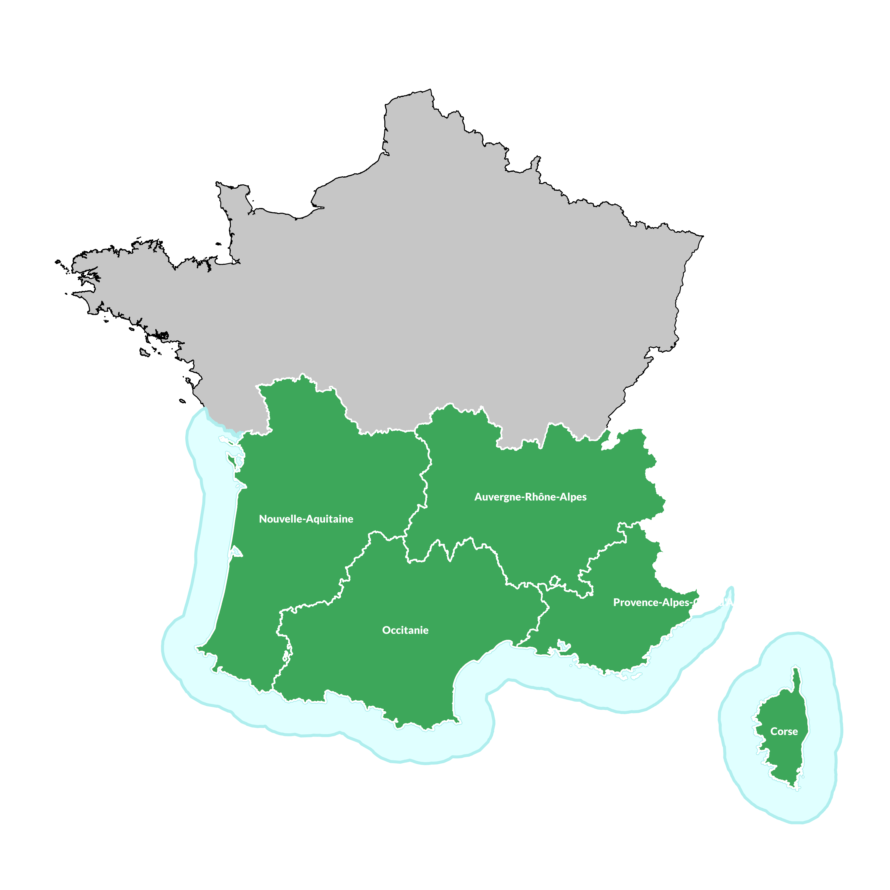
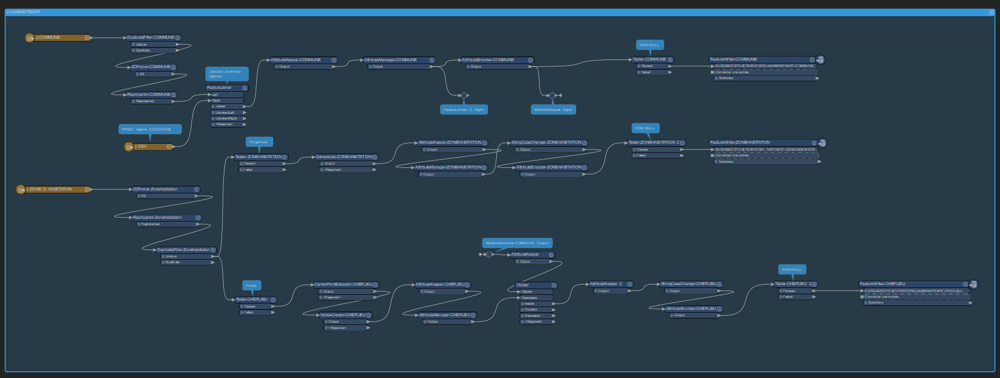
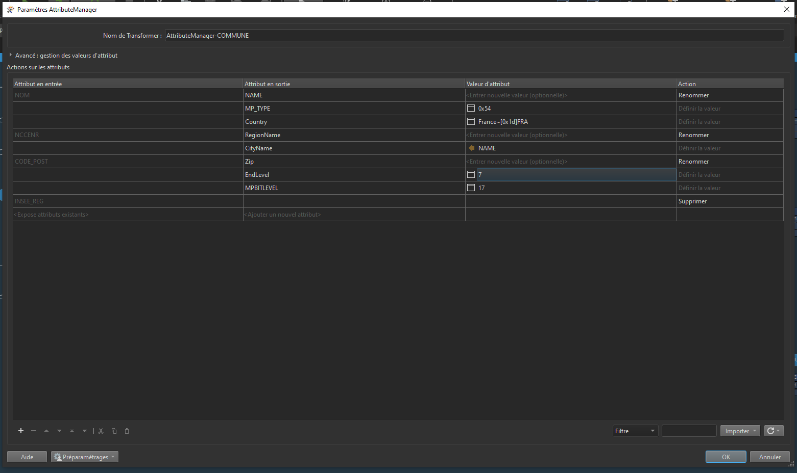
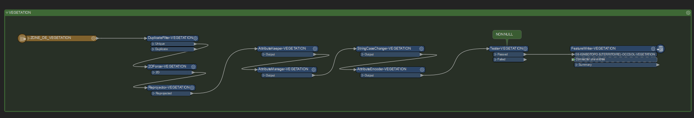
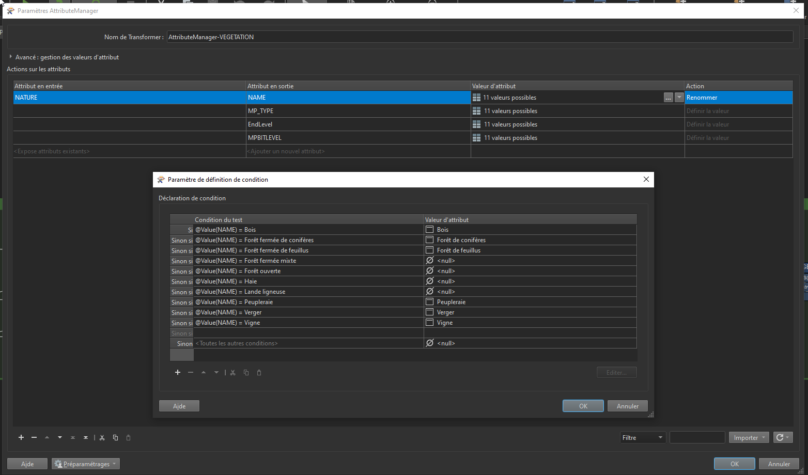
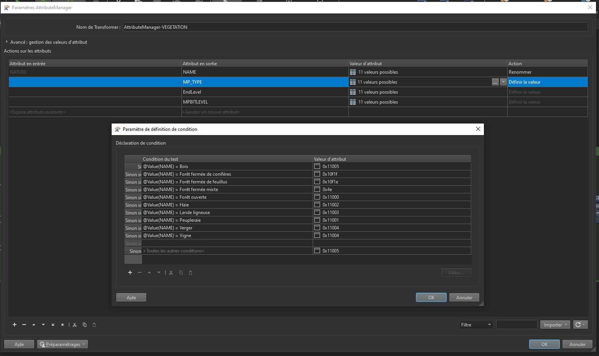
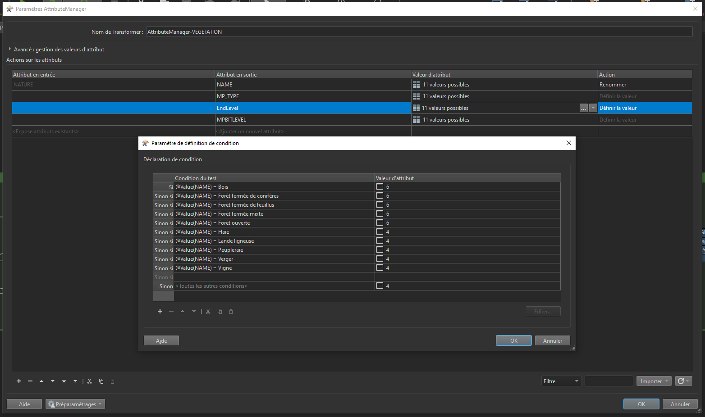
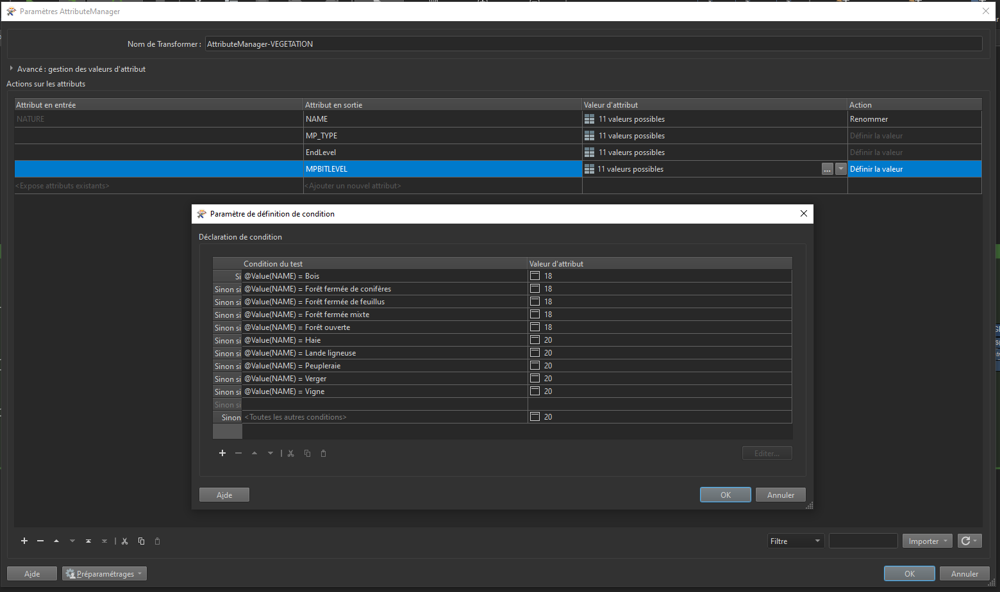

# **IGN BD TOPO®**

## **Téléchargement et préparation des données**

Je vais illustrer cette partie en prenant l'exemple de la réalisation de la carte SUD de la France. Après avoir téléchargé l'ensemble des régions concernées (Nouvelle-Aquitaine, Auvergne-Rhône-Alpes, Occitanie, Provence-Alpes-Côte d’Azur et la Corse) sur le [site de l'IGN](https://geoservices.ign.fr/bdtopo#telechargementshpreg).

Pour rappel, voici la couverture de la carte France SUD :
<figure markdown>
  { width="400" }
  <figcaption>Couverture France SUD</figcaption>
</figure>

L'arborescence de fichier générale :
```bash
GARMIN-IGN-BDTOPO-MAP/
├── 01-PROJECTS
├── 02-RESSOURCES
├── 03-DATA-INPUT
├── 04-DATA-OUTPUT
├── 05-POLISH-MP
├── 06-IMG
├── 07-MAPSET
├── 08-GMAPSUPP
├── 09-BASECAMP
```

Et mon arborescence stockant les données ESRI Shapefile provenant de la BDTOPO.
Ici, chaque dossier contient les fichiers ESRi Shapefile :
```bash
03-DATA-INPUT/
└── 01-IGN-BDTOPO
    └── 01-SHP
        └── FRANCE-SUD
            └── v2025.06
                ├── R75
                │   ├── ADMINISTRATIF
                │   ├── ADRESSES
                │   ├── BATI
                │   ├── HYDROGRAPHIE
                │   ├── LIEUX_NOMMES
                │   ├── OCCUPATION_DU_SOL
                │   ├── SERVICES_ET_ACTIVITES
                │   ├── TRANSPORT
                │   └── ZONES_REGLEMENTEES
                ├── R76
                │   ├── ADMINISTRATIF
                │   ├── ADRESSES
                │   ├── BATI
                │   ├── HYDROGRAPHIE
                │   ├── LIEUX_NOMMES
                │   ├── OCCUPATION_DU_SOL
                │   ├── SERVICES_ET_ACTIVITES
                │   ├── TRANSPORT
                │   └── ZONES_REGLEMENTEES
                ├── R84
                │   ├── ADMINISTRATIF
                │   ├── ADRESSES
                │   ├── BATI
                │   ├── HYDROGRAPHIE
                │   ├── LIEUX_NOMMES
                │   ├── OCCUPATION_DU_SOL
                │   ├── SERVICES_ET_ACTIVITES
                │   ├── TRANSPORT
                │   └── ZONES_REGLEMENTEES
                ├── R93
                │   ├── ADMINISTRATIF
                │   ├── ADRESSES
                │   ├── BATI
                │   ├── HYDROGRAPHIE
                │   ├── LIEUX_NOMMES
                │   ├── OCCUPATION_DU_SOL
                │   ├── SERVICES_ET_ACTIVITES
                │   ├── TRANSPORT
                │   └── ZONES_REGLEMENTEES
                └── R94
                    ├── ADMINISTRATIF
                    ├── ADRESSES
                    ├── BATI
                    ├── HYDROGRAPHIE
                    ├── LIEUX_NOMMES
                    ├── OCCUPATION_DU_SOL
                    ├── SERVICES_ET_ACTIVITES
                    ├── TRANSPORT
                    └── ZONES_REGLEMENTEES
```

## **Préparer ses données sources pour qu'elles soient conformes aux spécifications de fichiers ESRI Shapefile GARMIN**

Les données sources téléchargées, l'objectif à partir d'ici est de transformer la structure attributaire de ces fichiers ESRI Shapefile pour qu'elle soit conforme aux spécifications de fichiers ESRI Shapefile GARMIN.

Pour plus de clarté, j'ai créé différents **projets FME** afin d'exécuter cette transformation de manière globale sur l'ensemble des fichiers ESRI Shapefile. Pour certaines données géohraphiques, je ne m'interdis pas de réaliser quelques transformations géographiques également.

J'ai donc subdivisé ces **jobs FME** par thème et surtout par volume de données à travailler :

!!! tip "Astuce"
    Vous pouvez télécharger les jobs FME en cliquant sur les liens correspondants ci-dessous !
    
- [**01-IGN-BDTOPO-ESRI-SHP-PREPARE-TO-MP-POLISH-LOT-MAIN.fmw**](../../assets/resources/fme/01-IGN-BDTOPO-ESRI-SHP-PREPARE-TO-MP-POLISH-LOT-MAIN.fmw) :
    - `ADMINISTRATIF` : Limite de commune, zones urbanisées
        <figure markdown>
            { width="400" }
            <figcaption>Projet FME - Extrait sur le thème ADMINISTRATIF</figcaption>
        </figure>
        <figure markdown>
            { width="400" }
            <figcaption>Projet FME - Structure attributaire conforme aux spécifications de fichiers ESRI Shapefile GARMIN</figcaption>
        </figure>
    - `HYDROGRAPHIE` : Cours d'eau, lac, étangs, toponymes, etc...
    - `TOPONYMIE` : Lieux-Dits habités, Lieux-Dits non habités
    - `SERVICES_ET_ACTIVITES` : toponyme services et activités, Zones d'activités, lignes électrique
    - `ZONES_REGLEMENTEES` : forêts publiques
        
- **02-IGN-BDTOPO-ESRI-SHP-PREPARE-TO-MP-POLISH-LOT-VEGETATION.fmw** :
    - `OCCUPATION_DU_SOL` : Zone de végétation
        <figure markdown>
            { width="400" }
            <figcaption>Projet FME - Extrait sur le thème OCCUPATION_DU_SOL</figcaption>
        </figure>
        <figure markdown>
            { width="400" }
            <figcaption>Projet FME - Structure attributaire conforme aux spécifications de fichiers ESRI Shapefile GARMIN</figcaption>
        </figure>
        <figure markdown>
            { width="400" }
            <figcaption>Projet FME - Structure attributaire conforme aux spécifications de fichiers ESRI Shapefile GARMIN</figcaption>
        </figure>
        <figure markdown>
            { width="400" }
            <figcaption>Projet FME - Structure attributaire conforme aux spécifications de fichiers ESRI Shapefile GARMIN</figcaption>
        </figure>
        <figure markdown>
            { width="400" }
            <figcaption>Projet FME - Structure attributaire conforme aux spécifications de fichiers ESRI Shapefile GARMIN</figcaption>
        </figure>
- **03-IGN-BDTOPO-ESRI-SHP-PREPARE-TO-MP-POLISH-LOT-BATI.fmw** :
    - `BATI` : bâtiments, cimetières, constructions linéaires, constructions ponctuelles, terrains de sports, lignes orographiques, pylônes
- **04-IGN-BDTOPO-ESRI-SHP-PREPARE-TO-MP-POLISH-LOT-VOIRIE.fmw** :
    - `TRANSPORT` : routes, voies ferrées, piste d'aérodrome, transport par câble
