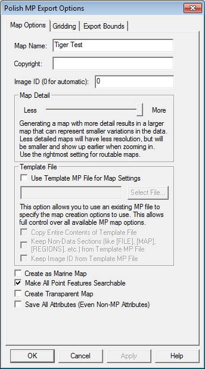

# **04-02/ Polski Format Mappy Files**

## Via Global Mapper

La commande d'export au format *.MP permet à l'utilisateur d'exporter n'importe quel ensemble de données vectorielles chargées au sein de Global Mapper au format de fichiers Polski Format Mappy Files. Le format *.MP polonais est le format d'entrée utilisé par l'application **cGPSMapper** et/ou **mkgmap** qui crée des cartes personnalisées pour des appareils GPS Garmin.

Lorsqu'elle est sélectionnée, la commande affiche la boîte de dialogue sur les options d'export (figure ci-dessous) qui permet à l'utilisateur d'établir l'export de ces fichiers. La boîte de dialogue se compose d'un onglet *Map Options*, *Gridding* et *Export Bounds* qui permet à l'utilisateur d'affiner son export de fichier.

<figure markdown>
  
  <figcaption>Polish MP Export Options</figcaption>
</figure>

Le nom de la carte et les champs de droit d'auteur permettent de spécifier le nom à utiliser pour la carte finale lorsqu'il est créé ainsi que le texte du droit d'auteur à associer à la carte.

La carte Détails La section vous permet de contrôler à quels niveaux de zoom la carte finale sera viewable à. Plus de détails résultats dans une carte qui représente mieux la forme des données sources, mais cela nécessite de zoomer plus loin pour voir la carte, alors que moins de détails aboutiront à une carte plus rougnante qui apparaît plus tôt. Vous si l'on doit l'apercevoir à l'échelle approximative de vos données sources, le réglage le plus faible détail des données vectorielles sources approximant environ 1:250K échelle et réglage le plus précis représentant 1:24K ou meilleure échelle les données.

La plupart intégré types ont déjà une échelle de zoom par défaut à laquelle ils apparaîtront dans Cartes MP construites (cela se traduira par une valeur de niveaus pour la fonctionnalité dans le fichier MP exporté en fonction des niveaux dans l'en-tête du fichier MP). Pour Types personnalisés et pour les types que vous souhaitez modifier l'échelle de zoom par défaut pour, vous pouvez ajouter un attribut MP-BIT-LEVEL à la fonctionnalité elle-même ou à la liste d'attributs par défaut pour un type de caractéristique. La valeur de cet attribut devrait spécifier le niveau de bit de zoom MP minimal qu'une caractéristique devrait apparaître à. Par exemple, si vous utilisez le réglage maximal de map Détail sans modèle fichier, vous obtiendrez une carte avec des niveaux de zoom habités à 24, 22 et 20 bits. Si vous vouliez qu'une fonctionnalité se présente dans les 2 niveaux de zoom inférieurs de cette carte (les couches de résolution de 24 et 22 bits), vous pouvez ajouter un MP-BIT-LEVEL attribut avec une valeur de 22 à votre fonctionnalité ou à l'attribut par défaut liste pour ce type, puis cette fonctionnalité obtiendrait une valeur de niveau 2 écrit au fichier MP exporté. Si votre carte avait moins de détails (par exemple, zoom les niveaux de 21, 19, et 17 bits), la même caractéristique n'apparaîtrait que dans la plus grande une couche détaillée de 21 bits en tant que caractéristiques sont toujours présentes dans au moins une couche de la carte. Si vous voulez qu'une fonctionnalité se présente toujours à tous les niveaux de zoom dans votre carte, quels que soient les niveaux de zoom présents, il suffit d'ajouter un MP-BIT-EVEL attribut d'une valeur de 1.

Le modèle Les sections de fichier vous permettent de sélectionner un fichier à utiliser comme modèle pour un nouveau fichier MP. Le nouveau fichier utilisera tous les paramètres de la sélection fichier modèle à l'exception de l'identifiant cartographique (à moins que vous ne cocherez l'ID de Keep Image ID à partir de l'option Template MP File) et, si vous fournissez un nom de carte, la carte nom. Cela inclut le cadre du dictionnaire et des paramètres de tous les niveaux. C'est ce que fournit un moyen pour les utilisateurs avancés de mettre en place un fichier MP exactement comment ils et exporter ensuite de nouvelles cartes avec les mêmes paramètres. Vous pouvez également vérifier l'option Copier tout le contenu du fichier de modèle pour tout avoir à partir de le fichier modèle copié sur le nouveau fichier in extenso, y compris toute fonctionnalité les données dans le fichier modèle.

Si sélectionné, l'option Créer en tant que carte marine spécifie que le fichier MP créé être marqués comme une carte marine et les caractéristiques marines seront utilisées le cas échéant. Il est à noter que la version marine de cGPSMapper est nécessaire pour créer des fonds marins. Cartes.

La marque Tous les éléments de point Caractéristiques Contrôles de recherche, que toutes les caractéristiques ponctuelles ou non dans la carte finale créée à partir du fichier MP devrait être consultable sur le Dispositif GPS. Si l'option Créer une carte transparente est sélectionnée, la carte être marquées comme transparentes et toutes les données figurant sur la carte apparaîtront à travers.

Si sélectionné, l'option Save All Attributes (Even Non-MP Attributes) spécifie que tous les attributs des caractéristiques exportées seront inclus dans les exportations. Fichier MP, plutôt que seulement les attributs reconnus pour cette fonctionnalité type par format MP. La plupart des utilisateurs n'auront jamais besoin de l'utiliser.

Quand Global Mapper exporte les données vectorielles chargées à un fichier MP, il tentera automatiquement de déterminer le meilleur type à enregistrer dans le fichier MP sur la base de la classification de figure dans Global Mapper. Si aucun type de cartographie n'est connu, le nom de la classification Global Mapper attribuée sera utilisé pour la valeur «Type». dans le fichier MP. Si vous avez mis à jour votre fichier RgnTypes.txt dans votre cGPSMapper Dossier avec les noms de type et le numéro de type approprié, vous pouvez faire Cela fonctionne aussi. Vous pouvez également spécifier manuellement le numéro de type à utiliser pour une fonctionnalité en ajoutant un attribut nommé MP-TYPE avec la valeur de type utiliser comme valeur d'attribut. Si la valeur que vous apportez est pour un type marin, vous devez également fournir un attribut avec un nom de MARINE et une valeur de Y. Vous pouvez également passer outre le mappage de type par défaut pour intégré en ajoutant une liste d'attributs par défaut pour le type sur les styles de l'information onglet du dialogue Configuration. Il suffit d'ajouter un attribut MP-TYPE à la valeur par défaut Liste d'attributs pour un type à spécifier manuellement quel type utiliser dans l'exportation Fichiers MP pour un Global Mapper donné type.

Global Mapper convertira automatiquement les données exportées en données projection et données appropriées pour l'exportation afin que le fichier polonais MP seront correctement positionnés. Par défaut, ce sera le degré lat/lon avec la donnée WGS84, bien que si vous utilisez un fichier modèle qui a spécifié une donnée reconnue différente, Global Mapper se convertira automatiquement à cette donnée. En tout état de cause, Global Mapper fera toujours automatiquement ce qu'il faut.

Avancé Utilisateurs : Si vous n'utilisez pas un modèle pour configurer votre exportation, vous pouvez personnaliser les valeurs utilisées pour plusieurs réglages dans l'en-tête en ajoutant clés de registre. Les valeurs suivantes sont prises en compte:

- TreSize - Ajouter une valeur de registre DWORD en utilisant 'regedit' à l'adresse suivante: 'HKEY'CURRENT-USER-Software-Global Mapper-MPExport-TreSize avec la valeur souhaitée.
- RgnLimit - Ajouter une valeur de registre DWORD en utilisant 'regedit' à l'adresse suivante: 'HKEY'CURRENT-USER-Software-Global Mapper-MPExport-RgnLimit' avec la valeur souhaitée.
