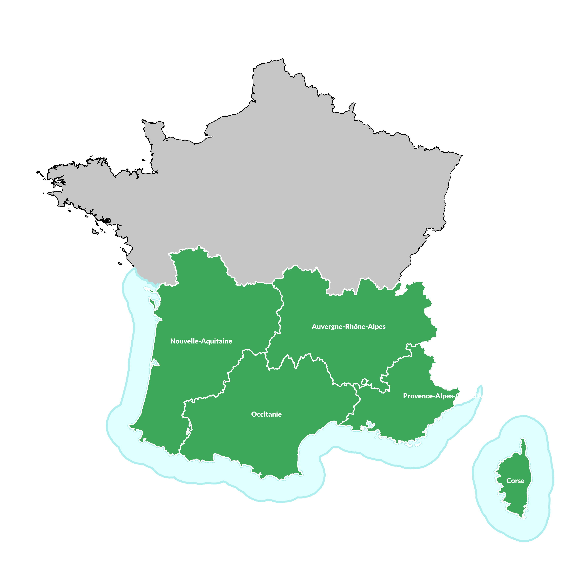

# **:material-book-education: Un guide pas à pas**

## **Comment créer des cartes Garmin Topo personnalisées**

Ce didacticiel explique comment créer des cartes topographiques personnalisées compatibles avec les unités GPS Garmin. Ce didacticiel comporte de nombreuses étapes vous expliquant comment créer des cartes avec des logiciels propriétaire (donc soumis à licence et payant), accessibles financièrement et/ou gratuits.

Il n'y a pas d'ordre prédéfini pour la création des fichiers ESRI Shapefile aux spécifications GARMIN et compatible pour l'export au format Polish Map Format **.MP**. 

Vous pouvez organiser la création de ces derniers comme bon vous semble. Il suffit d'ajouter l'ensemble des fichiers **ESRI Shapefile** créés, à l'étape de transformation en fichier **.MP**  pour les compiler en fichier **.IMG** dans l'étape finale de compilation.

## **Les 3 étapes clés**

- Préparer ses données sources pour qu'elles soient conformes aux spécifications de fichiers ESRI Shapefile GARMIN,
- Convertir cet ensemble de fichiers au format Polski Format Mappy — Format de carte polonais - *.MP,
- Compiler les fichiers au format Polski Format Mappy — Format de carte polonais - *.MP en GARMIN .IMG.

## **Difficultées rencontrées**

Une des principales difficulté rencontrée lors de l'élaboration d'une carte topo Garmin personnalisée **est la gestion de la volumétrie de données**.

Dans un premier temps, j'ai testé mon processus de création sur un faible jeu de données (téléchargement du jeu de données de la **BD TOPO®** sur l'unique département de l'Isère). Le but de ce laboratoire était de réaliser 2 cartes topo principales correspondant au Sud et au Nord de la France.

Voici la couverture des 2 cartes :
<figure markdown>
  { width="400" }
  <figcaption>Couverture France NORD</figcaption>
</figure>
<figure markdown>
  { width="400" }
  <figcaption>Couverture France SUD</figcaption>
</figure>

!!! Abstract "Nota"
    Vous constaterez que la couverture de la carte France Nord est constituée des régions Bretagne, Normandie, Hauts-de-France, Grand-Est, Île-de-France, Pays-de-la-Loire, Centre-Val-de-Loire et Bourgogne-France-Comté.

    La carte France Sud, quant à elle, est constituée des régions Nouvelle-Aquitaine, Auvergne-Rhône-Alpes, Occitanie, Provence-Alpes-Côte d’Azur et la Corse.

    En conclusion, il faudra télécharger la **BD TOPO®** sur l'ensemble de ces régions sur le site de l'[IGN](https://geoservices.ign.fr/bdtopo#telechargementshpreg) pour construire nos cartes topo personnalisées. Ce qui représente déjà un certaine volume de données à télécharger.

Pour mes tests, j'ai donc téléchargé uniquement le territoire de l'Isère. Ce dernier est un fichier ZIP d'environ 325Mo.
<figure markdown>
  
  
  <figcaption>Téléchargement de la dernière édition de la **BD TOPO®** sur le département de l'Isère qui pèse 325 MO</figcaption>
</figure>

Une fois mes tests réalisés avec succès, j'ai entrepris de lancer les 2 cartes France Nord et Sud qui représentent pour chacune des cartes, un peu moins de **500GO** de données brassées répartie entre le téléchargements de données brutes et les fichiers retravaillés au format ESRI Shapefile ou au format .MP pour la compilation des fichiers .IMG, pour au final, arriver à des fichiers pour la carte France Nord de **2.6GO** et pour la France Sud de **3.2GO**.

## Configurer votre PC

### Téléchargement et installation des logiciels requis

Bien qu'il existe de nombreuses méthodes différentes qui peuvent être utilisées pour y parvenir, ce tutoriel utilisera certains logiciels clés comme :

- FME,
- GLOBAL MAPPER,
- GDAL/OGR2OGR,
- QGIS,
- GMAPTool,
- TYPViewer,
- GPSMAPEdit,
- Basecamp

## **Guide pas à pas**

- **Partie 01 : Préparation des fichiers ESRI Shapefile aux spécifications GARMIN** :
    - [Données d'élévation/Courbes de niveau - Téléchargement et traitement des données USGS DEM](/04-tutorials/garmin-shp-specs/contours/)
- **Partie 02 : Export des fichiers ESRI Shapefile aux spécifications GARMIN au format Polski Format Mappy — Format de carte polonais .MP** :
    - Coming soon
- **Partie 03 : Export des fichiers Polski Format Mappy — Format de carte polonais .MP au format GARMIN .IMG** :
    - Coming soon
