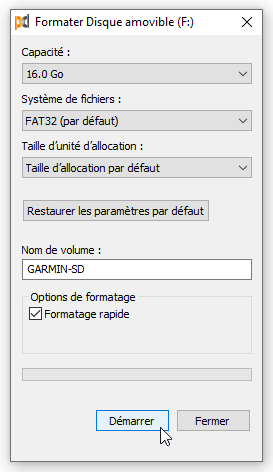
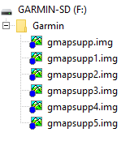

# Procédure d'installation sur carte SD

1. Munissez-vous d'une Carte micro-SD vierge ou fraichement formattée (Min. 8GB - Max. 32GB) : 
2. [Téléchargez la ou les cartes](/downloads.md) que vous souhaitez installer sur l'appareil Garmin,
3. Lorsque vous téléchargez une carte Garmin Topo personnalisée sur ce site, vous téléchargez un fichier au format ZIP,
4. Ce fichier est nommée IGN-BDTOPO-2022-RXX.zip avec XX le code INSEE "Région" en vigueur (ex: IGN-BDTOPO-2022-R94.zip pour la Corse),
5. Ce fichier ZIP est spécialement formatté pour être directement dézippé ou copié sur votre carte SD,
6. Il contient un dossier racine nommé **Garmin** dans lequel se trouve le fichier **gmapsupp.img**,
7. Copiez ce dossier **Garmin** à la racine de votre carte micro-SD,
8. Retirez votre carte micro-SD et l'insérez dans votre appareil Garmin,
9. ***À la suite de ces opérations, il vous suffit d'activer la carte ou de vérifier qu'elle soit active dans ce dernier.***

**PS** : Il vous est possible d'installer plusieurs cartes sur votre appareil Garmin.

Pour cela, il suffit de :

- Télécharger la carte supplémentaire,
- Préalablement, renommer le fichier gmapsupp.img issu du téléchargement, en le suffixant gmapsupp1.img, gmapsupp2.img, etc... suivant le nombre de cartes présentes sur la carte micro-SD,
- Copier ce fichier dans le dossier Garmin de votre carte micro-SD :

<figure markdown>
  
  <figcaption>Plusieurs cartes sur la carte SD</figcaption>
</figure>
