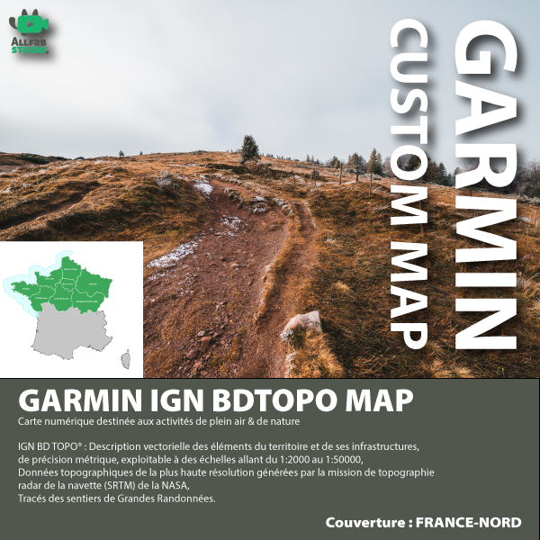
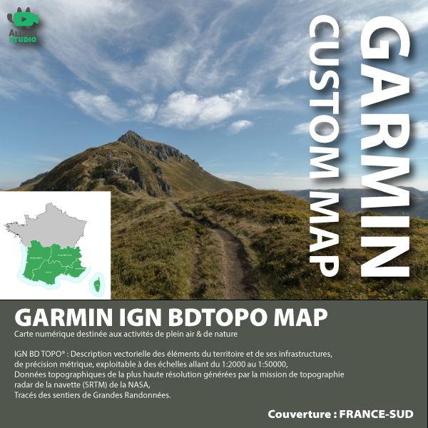

# 05-01/ :material-map: France NORD et SUD

-   :fontawesome-regular-square-caret-up:{ .lg .middle } France NORD

    ---

    { align=center }

    [:material-download: Télécharger](#)

-   :fontawesome-regular-square-caret-down:{ .lg .middle } France SUD

    ---

    { align=center }

    [:material-download: Télécharger](#)

