# 05-02/ :material-map-search: Régions

-   :fontawesome-regular-square-caret-up:{ .lg .middle }  Île-de-France - R11

    ---

    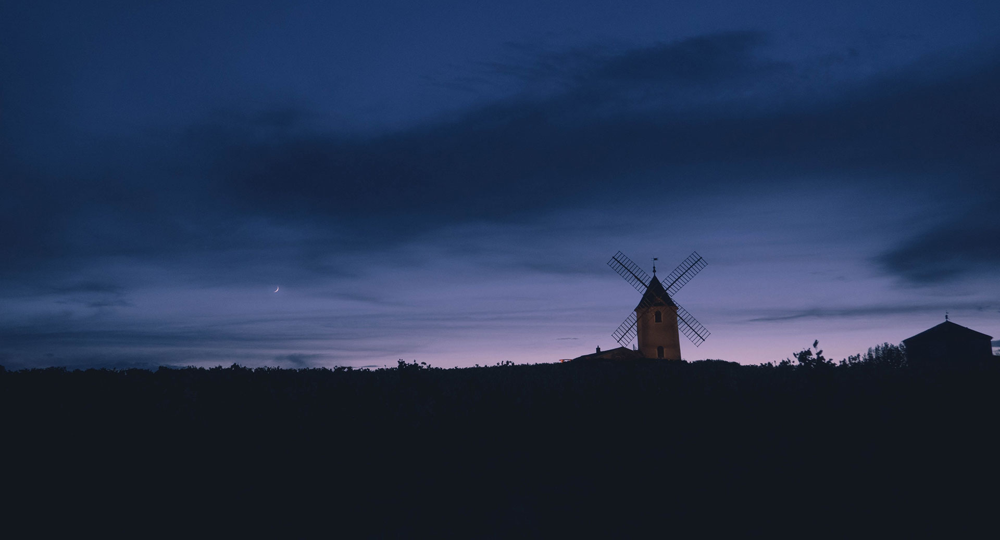

    [:material-download: Télécharger](#)

-   :fontawesome-regular-square-caret-down:{ .lg .middle } Bourgogne-Franche-Comté - R27

    ---

    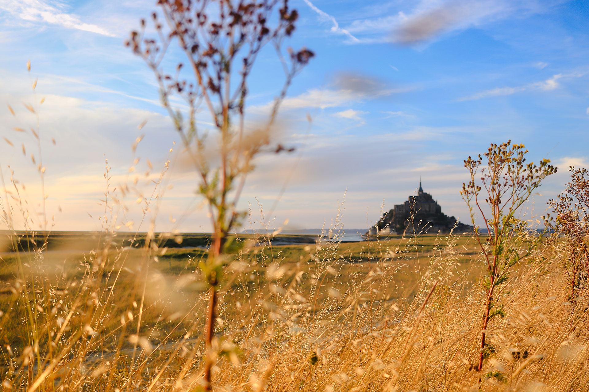

    [:material-download: Télécharger](#)

-   :fontawesome-regular-square-caret-down:{ .lg .middle } Normandie - R28

    ---

    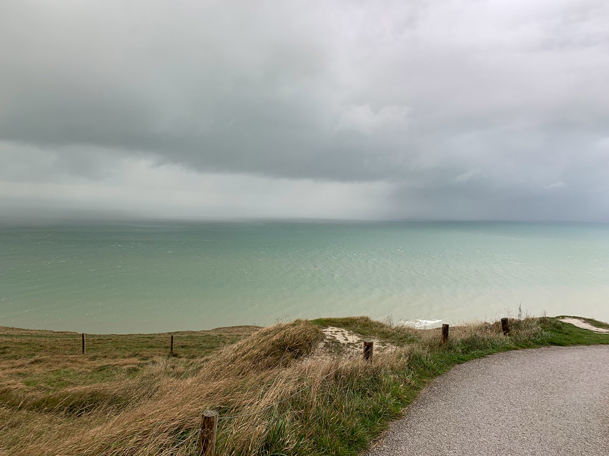

    [:material-download: Télécharger](#)

-   :fontawesome-regular-square-caret-down:{ .lg .middle } Hauts-de-France - R32

    ---

    

    [:material-download: Télécharger](#)

-   :fontawesome-regular-square-caret-down:{ .lg .middle } Grand Est - R44

    ---

    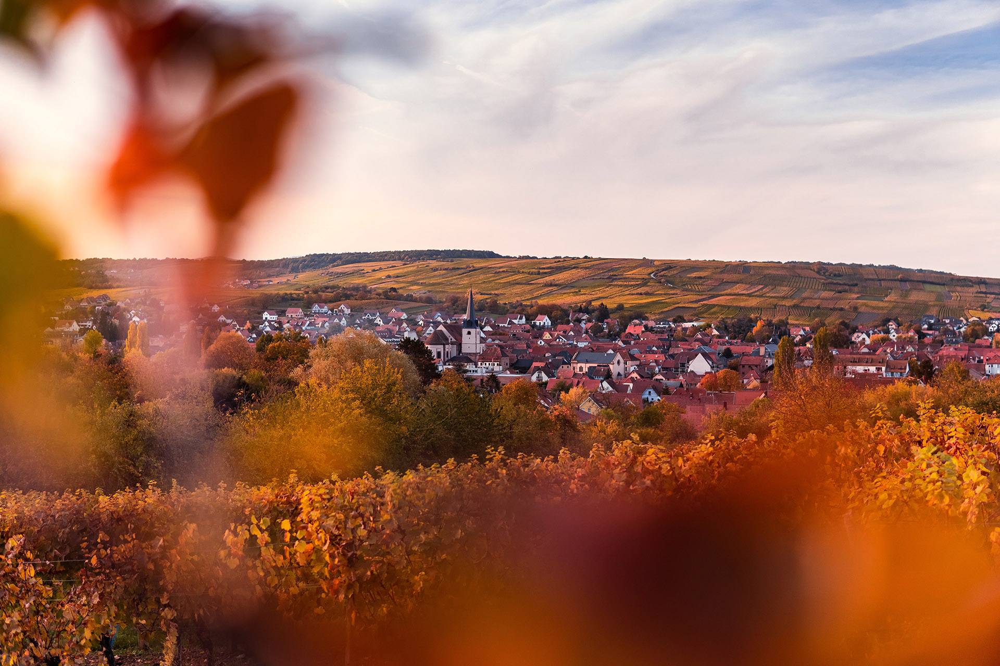

    [:material-download: Télécharger](#)

-   :fontawesome-regular-square-caret-down:{ .lg .middle } Pays de la Loire - R52

    ---

    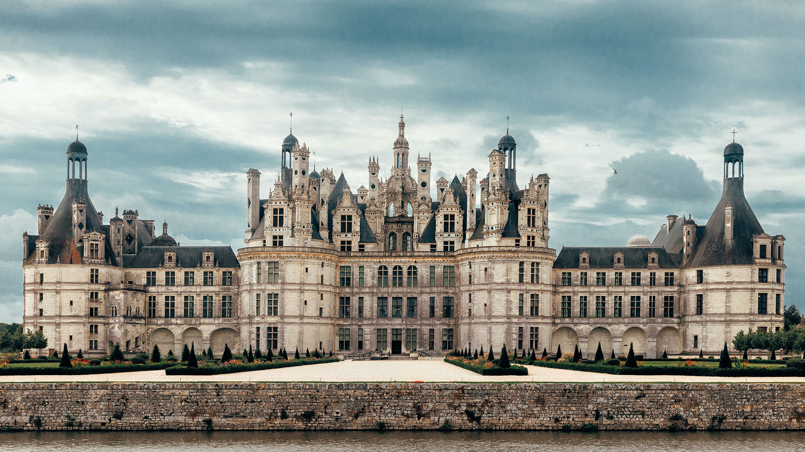

    [:material-download: Télécharger](#)

-   :fontawesome-regular-square-caret-down:{ .lg .middle } Bretagne - R53

    ---

    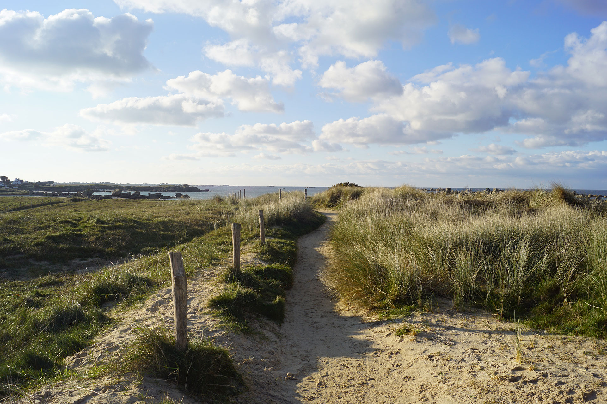

    [:material-download: Télécharger](#)

-   :fontawesome-regular-square-caret-down:{ .lg .middle } Nouvelle-Aquitaine - R75

    ---

    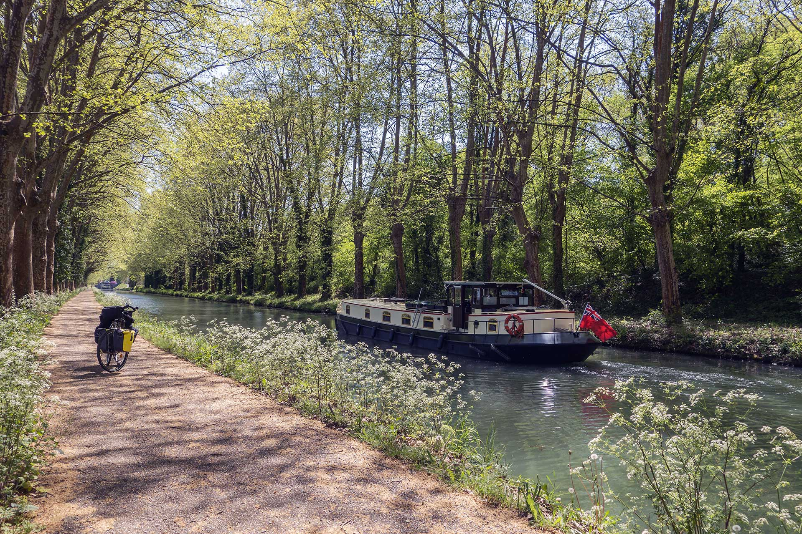

    [:material-download: Télécharger](#)

-   :fontawesome-regular-square-caret-down:{ .lg .middle } Occitanie - R76

    ---

    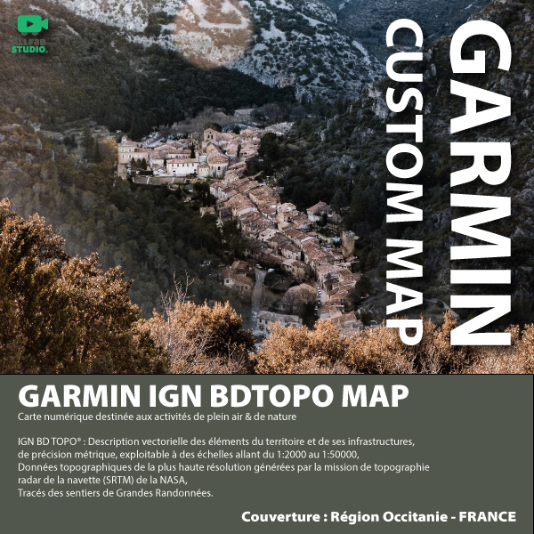

    [:material-download: Télécharger](#)

-   :fontawesome-regular-square-caret-down:{ .lg .middle } Auvergne-Rhône-Alpes - R84

    ---

    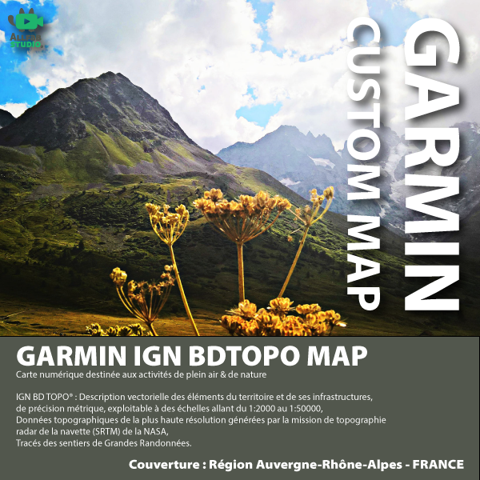

    [:material-download: Télécharger](#)

-   :fontawesome-regular-square-caret-down:{ .lg .middle } Provence-Alpes-Côte d’Azur - R93

    ---

    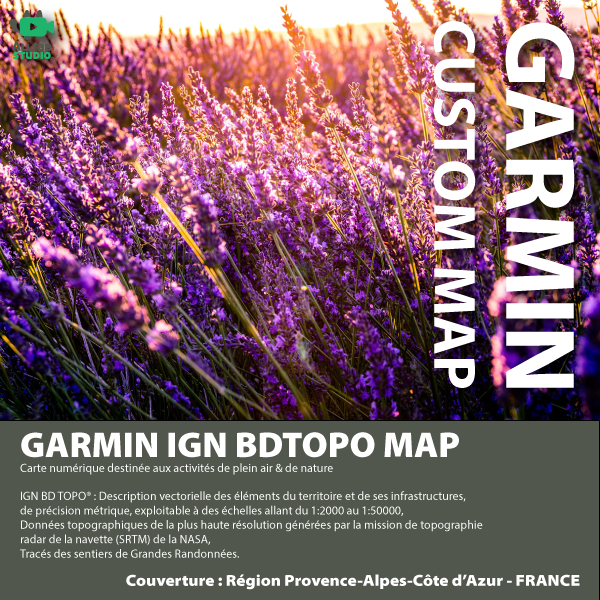

    [:material-download: Télécharger](#)

-   :fontawesome-regular-square-caret-down:{ .lg .middle } Corse - R94

    ---

    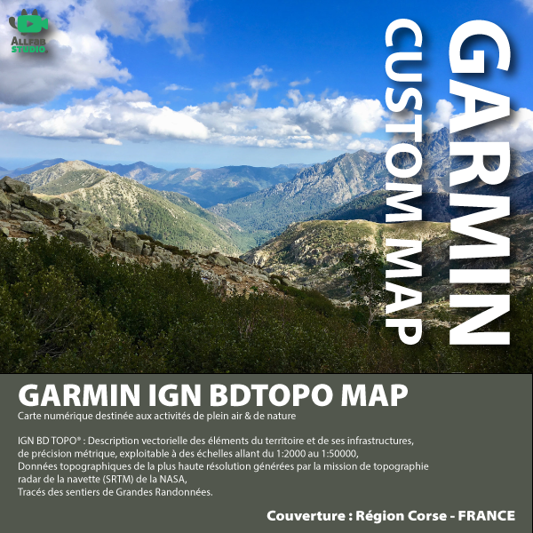

    [:material-download: Télécharger](#)

