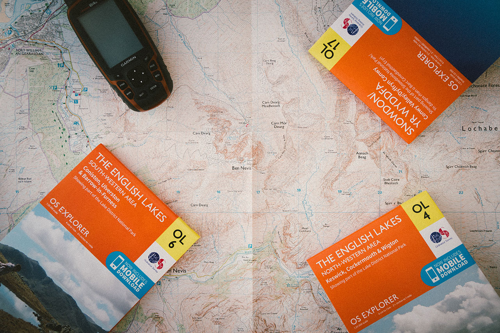
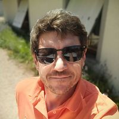

# **BIENVENUE SUR GARMIN IGN BDTOPO MAP**

Le but de ce site est la mise à disposition de cartes topographiques personnalisées Garmin compatibles avec un GPS de randonnée de la marque **Garmin** ou encore les appareils de suivi de chien tels que **l'Alpha® 100F, l'Alpha® 200F, l'Alpha® 50F ou encore l'Astro® 320** *(qui n'est plus en vente à l'heure actuelle)*.

Vous trouverez aussi une série d’articles dans le but d’expliquer, aux cartographes en herbe et/ou aux plus confirmés, le processus de création des cartes topographiques compatibles avec un GPS de randonnée Garmin ou encore les appareils de suivi de chien tels que l’Alpha® 100F, l’Alpha® 200F/300F ou encore l’Astro 320 (qui n’est plus en vente à l’heure où j’écris cet article).

<figure markdown>
  {: width=660 }
  <figcaption><i>Photo par Drew Collins sur <a href="https://unsplash.com" target="_blank">Unsplash.com</a></i></figcaption>
</figure>

Pour réaliser ces cartes, je me suis fortement inspiré de la série d’article publiée sur le site [GPSFileDepot](https://www.gpsfiledepot.com/). Ces articles ont été publié en 2008, puis mis à jour en 2016. À noter que je n’utiliserai pas l’entièreté des logiciels présentés dans ces articles et viendrai même en ajouter une paire dans la trousse à outils du géomaticien !

!!! info "OBJECTIF"
    Nous aborderons les logiciels, les structures de dossiers, les informations de téléchargement des données cartographiques et leur traitement afin d’obtenir une carte Garmin Topo personnalisée.

## **:material-lightbulb-on: Prérequis**

De nombreux aspects de ce tutoriel sont basés sur mon expérience et celle des autres géomaticiens qui ont déjà tenté de constituer ce genre de carte Garmin.

## **:fontawesome-solid-feather-pointed: À propos de l'auteur**

{: align=right width=180 }
Cette documentation est écrite et maintenue par [Fabien ALLAMANCHE](https://www.linkedin.com/in/fabien-allamanche/) (alias [@allfab](https://mapstodon.space/@allfab)). 
